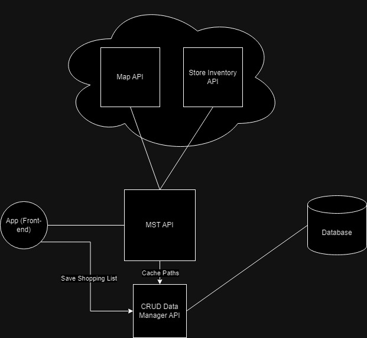

# SpeedCart
A web app for creating a convenient shopping route for a given set of items.
Current deployment: https://www.speedcartapp.com
# Problem addressed
Grocery shoppers often face the challenge of efficiently navigating through stores, finding items on their shopping list, and optimizing their routes. SpeedCart aims to streamline this process by providing a user-friendly web app that creates convenient shopping routes based on a given set of items. By doing so, it helps users save time and make more cost-effective decisions during their shopping trips.

# Architecture
This web app adopts a Service-Oriented Architecture (SOA) to enhance scalability, maintainability, and flexibility. The use of separate services for mapping routes and checking store inventory allows SpeedCart to efficiently perform these essential tasks while providing a modular and extensible design.

## Details
### APIs
SpeedCart utilizes two main APIs for its core functionalities:

- **Map API:** Provides route information for optimizing shopping routes.
- **Store Inventory API:** Checks item stock status at grocery stores.

### Error Handling
As part of its Service-Oriented Architecture, SpeedCart notifies users when stock or route information cannot be obtained.

### User Interaction
SpeedCart allows users to save their shopping list on the platform for later reuse.

# Features
- **Shopping List UI:** Enables users to easily create and manage their shopping lists through an intuitive user interface.
- **CRUD Data Manager API:** Facilitates the creation, retrieval, updating, and deletion of data, supporting various operations crucial for the app's functionality.

### Citation Info
The writing of this document was assisted by ChatGPT on Dec. 20, 2023
Document updates:
Jan. 15, 2024 - Updated naming from ShopFast to SpeedCart for trademark reasons